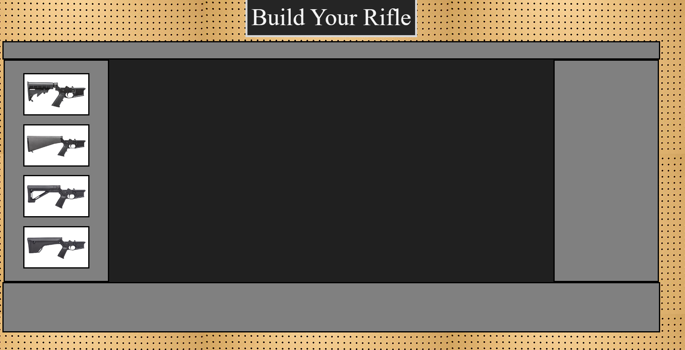
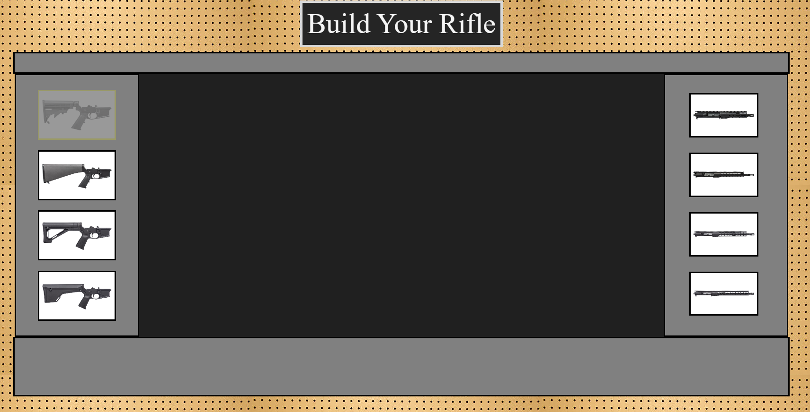
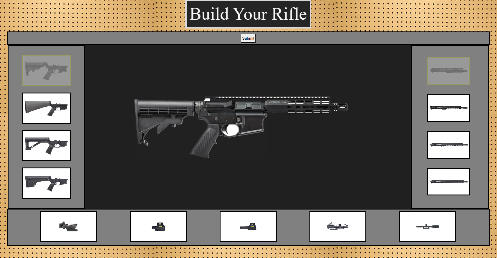
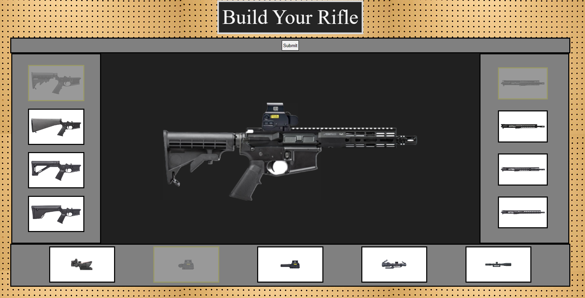
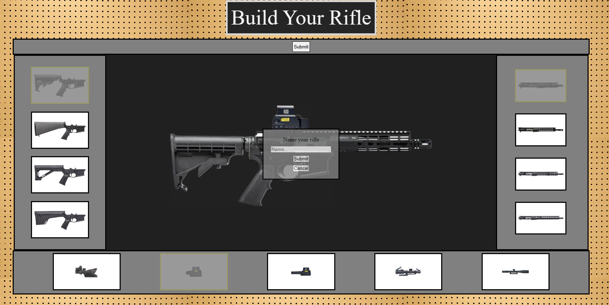
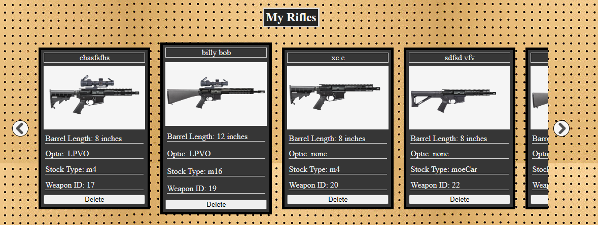
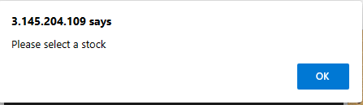
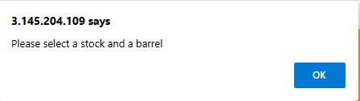
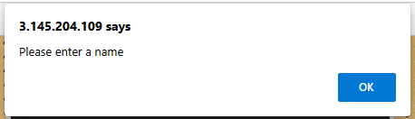

# Gun Builder
A Foundations Capstone Project
by Andrew Lohman

## APP Language
Application framework:
```
HTML
CSS
```

Application functonality by:
```
JavaScript
express
cors
```
## App functionality
### Landing page
The Landing page contains the entirety of the website.
initially it will display en empty table in the middle with stock options to choose from on the left



Once a stock is selected, the butten pressed will remain highlighted as refference and the barrel options will display.



When you select a barrel, optic options will show up as well as an image of what the current rifle looks like.



You can then choose to submit the gun as is (see next step) or continue and choose an optic. Both the barrel buttons and optic buttons will remain highlighted until they are submitted or another option is chosen.



When you are satisfied with the product and press submit, this box will appear prompting you to name your gun. A name must be added (see warnings). Once the submit button in the box is pressed all fields are cleard of markings so you can start over again.



each submission creates a gun card and places the card in the "My Rifles" section. The section is a carosel meaning that it will only display a few cards at a time. To cycle through the cards not on screen, all you need to do is cycle through the right or left arrow buttons on either side. the cards have a hover feature when they are moused over and each card can be deleted.



## App warnings
The "No Stock Selected" warning is displayed when you try to add a barrel without first selecting a stock.



The "No Barrel Selected" warning displays when you try and select an optic before a stock or barrel are selected.



The "No Name" warning is displayed when a user tries to sumbmit a rifle that hasn't been named.




## App sources and links
all photos attributed to [Aero Precision](https://www.aeroprecisionusa.com/)

Link to [Demo Video](https://secure.vidyard.com/organizations/3064372/players/pWVdhkuBMurkEDnqQVNPb2?edit=true&npsRecordControl=1)